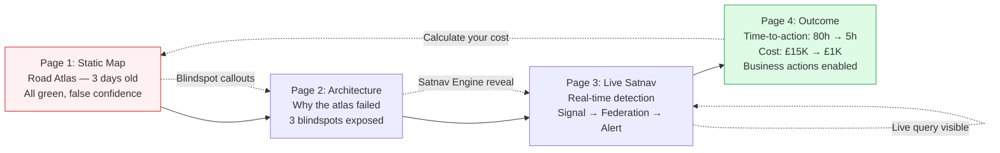

# Demo Story Enhancement Plan — "Road Atlas → Satnav" Narrative Arc

## Top-Level Overview

**Goal:** Strengthen the demo narrative so every audience (C-suite, Data Architect, Supply-Chain, IT Director) immediately grasps:
1. **What we enable:** Real-time detection & reaction vs. static weekly reports
2. **What's new:** Live federated queries across ERP + operational data + external threat feeds — zero ETL, on IBM Power
3. **How detection works:** The "satnav" analogy — continuous cross-referencing of external signals against internal dependencies
4. **What it enables:** Business action in minutes/hours instead of days, with quantified cost avoidance
5. **How it runs in production:** The demo button = continuous ingestion pipeline (polling CISA KEV, route webhooks, Kafka/Flink streaming) that auto-triggers the *same federated query* and routes alerts to SIEM/SOAR/ServiceNow/PagerDuty

**Scope:** Narrative/UX enhancements to the existing 4-page demo arc. No infrastructure changes. The federation engine works (`source: "live"` confirmed).

**Approach:** Layer the "road atlas → satnav" metaphor consistently across all four pages. Make the *detection moment* visceral. Ensure the "so what?" business value lands for each audience persona. **Explicitly connect the demo trigger (button) to the production pipeline (continuous) at every stage.**

---

## Sub-Tasks

### Sub-Task 1: Refine the "Static Map" (Page 1 — `/`) — The Road Atlas Moment

**Intent:** Make the "outdated paper atlas" metaphor immediately felt. The audience should *feel* the false confidence of the green KPIs before we reveal the reality.

**Expected Outcomes:**
- Stale timestamp is unavoidable — not a subtle banner
- "Blindspot" callouts explicitly name what the report *cannot* see (tier-2 suppliers, live threat feeds, real-time route status)
- Presenter script baked into the page as speaker notes / hover tooltips
- CTA button text reinforces the metaphor: "See what the atlas missed →"

**Todo List:**
- [ ] Replace subtle amber warning banner with a prominent "This map is 3 days old" visual (timestamp + map-age indicator)
- [ ] Add explicit "What this report CANNOT see" callout boxes on each table (tier-2 suppliers, live threat intel, real-time road conditions)
- [ ] Embed presenter script as collapsible "Speaker Notes" panel (toggleable, for rehearsal)
- [ ] Change CTA button: "See the Live Satnav →" (reinforces metaphor)
- [ ] Add a "Road Atlas" visual metaphor element (paper map icon, folded corners) in header

**Relevant Context:**
- File: `demo-ui/src/pages/index.tsx` (lines 1-287)
- Current: Lines 103-117 have subtle warning; lines 189, 238 have blindspot footnotes
- Components: None — pure page

---

### Sub-Task 2: Elevate the "Architecture" Page (Page 2 — `/sources`) — The "Why the Atlas Failed" Explanation

**Intent:** Connect each data source's blindspot directly to the static report's omissions. Show *why* the atlas was wrong.

**Expected Outcomes:**
- Each source card explicitly links its blindspot to a specific omission on Page 1
- The "Real-Time Continuous Detection" banner becomes the "Satnav Engine" reveal
- Clear visual: Static Report (Page 1) ← blindspots → Three Sources (this page) → Satnav (Page 3)

**Todo List:**
- [ ] Add cross-reference links on each source card: "This blindspot caused the Static Map to miss: [specific Page 1 omission]"
- [ ] Rename banner to "The Satnav Engine: Real-Time Detection on IBM Power"
- [ ] Add a small diagram: External Signal → Federation Query → Internal Dependency Match → Alert
- [ ] Make the "Launch Live Satnav" button the primary visual focus
- [ ] Add speaker notes explaining the federation architecture in business terms (not technical)

**Relevant Context:**
- File: `demo-ui/src/pages/sources.tsx` (lines 1-296)
- SOURCES array (lines 14-66) defines the three sources with blindspots
- Banner at lines 234-291 is the transition moment

---

### Sub-Task 3: Make the "Live Satnav" (Page 3 — `/live`) Viscerally Real-Time

**Intent:** The audience must *see* detection happening — not just be told it works. The "satnav rerouting" moment should feel live. **Critically: the demo button press stands in for a continuous production pipeline.**

**Expected Outcomes:**
- Signal injection feels like a live traffic alert popping up on a satnav
- The federated query execution is visible (loading state with "Querying IBM i × PostgreSQL × Iceberg... ✓ Complete in 1.2s")
- Alert card explicitly states: "This was INVISIBLE to your ERP" with the `erp_visibility` punchline prominent
- Data Source Panel shows live query SQL being executed (optional "Show Query" toggle)
- **Production Pipeline indicator**: Small badge/link showing "In production: continuous pipeline (polling/webhooks/streaming) → auto-triggers this same query"

**Todo List:**
- [ ] Enhance SignalControlPanel: Add "Inject Live Signal" button with pulse animation
- [ ] Add federated query execution indicator in AlertCardsPanel: "Running federated query across 3 sources... ✓ Complete in 1.2s"
- [ ] Make `erp_visibility: 'NOT VISIBLE IN ERP WITHOUT FEDERATION'` a highlighted badge on the alert card (red accent)
- [ ] DataSourcePanel: Add "Live Query" tab showing the actual SQL sent to watsonx.data
- [ ] Add "Time since signal ingested" live counter on alert cards
- [ ] Add "Production: Continuous Pipeline" indicator near inject button with tooltip explaining the production architecture (polling CISA KEV, webhook route feeds, Kafka/Flink stream processing)
- [ ] Ensure the "See the outcome →" button only enables after alert fires (already works)

**Relevant Context:**
- Files: `demo-ui/src/pages/live.tsx`, `demo-ui/src/components/SignalControlPanel.tsx`, `demo-ui/src/components/AlertCardsPanel.tsx`, `demo-ui/src/components/DataSourcePanel.tsx`
- Detection logic: `demo-ui/src/pages/api/detect-signals.ts` (lines 42-88 fetchCyberExposure, 95-139 fetchWildfireExposure)
- Key punchline at line 238: `erp_visibility: 'NOT VISIBLE IN ERP WITHOUT FEDERATION'`
- Production pipeline: CISA KEV API polling (5-min), Route telemetry webhooks, Kafka/Flink stream processor → triggers same federated query

---

### Sub-Task 4: Sharpen the "Outcome" Page (Page 4 — `/outcome`) — The Business Value Receipt

**Intent:** The timeline comparison already exists. Make the *cost of the atlas* vs *value of the satnav* undeniable with quantified business metrics.

**Expected Outcomes:**
- Time-to-action and cost-avoidance numbers are the hero metrics (large, prominent)
- "What this enables" column: specific business actions (re-route POs, pre-qualify suppliers, protect SLAs)
- Power pillars reframed as "Why IBM Power Makes This Possible" — not just technical specs
- Closing CTA: "Your atlas is costing you £X per incident. Here's the satnav."

**Todo List:**
- [ ] Enlarge time-to-action and cost metrics — make them the visual focal point
- [ ] Add "Business Actions Enabled" summary cards: "11 POs re-routed before Monday", "0 SLA breaches", "£14K saved"
- [ ] Reframe Power pillars: "IBM i = Your ERP runs here securely", "MMA = AI scoring on-box", "Hybrid = Workload mobility"
- [ ] Add a "Calculate your atlas cost" interactive element (simple: incidents/year × avg cost)
- [ ] Closing screen with tailored next steps per audience (CISO → security posture; Architect → zero-ETL; Supply-chain → exposure visibility)

**Relevant Context:**
- File: `demo-ui/src/pages/outcome.tsx` (full file)
- Timeline data: CYBER_OLD/NEW (lines 15-48), WILDFIRE_OLD/NEW (lines 50-83)
- Power pillars: PILLAR_IBMI, PILLAR_MMA, PILLAR_CYBER, PILLAR_HYBRID (lines 87-142)

---

### Sub-Task 5: Create Audience-Specific "Story Briefs" (Presenter Assets)

**Intent:** Give the seller tailored opening/closing scripts for each audience persona, so the demo lands without improvisation. **Each brief must include the "production pipeline" explanation for that audience.**

**Expected Outcomes:**
- 4 audience-specific story briefs (CISO, Data Architect, Supply-Chain/Procurement, IT Director/C-suite)
- Each brief: 30-second opening, 2-minute arc narration, 30-second close with objection handling
- Mapped to the 4-page flow with specific "point here, say this" cues
- **Each brief includes: "In production, this button = continuous pipeline (polling/webhooks/streaming) → auto-triggers same query → your SIEM/SOAR"**

**Todo List:**
- [ ] Create `STORY-BRIEFS.md` with 4 audience variants
- [ ] Each variant: Opening hook (road atlas analogy tailored), Page-by-page narration, Punchline moments, Objection responses
- [ ] Include the "How detection works" explanation in plain language for each audience
- [ ] **Add production pipeline explanation per audience:**
  - CISO: "Continuous threat feed ingestion → auto-enrichment with your supplier graph → SIEM ticket"
  - Data Architect: "Kafka/Flink stream processor → normalised signal topic → federated Presto query → Iceberg sink"
  - Supply-Chain: "Route feed webhook → warehouse route match → PagerDuty alert to on-call manager"
  - IT Director: "Managed ingestion pipeline on OpenShift → watsonx.data federation → ServiceNow workflow"
- [ ] Link to the story-builder skill for dynamic customisation

**Relevant Context:**
- Skill: `.bob/skills/watsonx-data-power-story-builder.md` (lines 122-129 audience-specific emphasis table)
- Existing story brief template at lines 135-144
- Production pipeline: CISA KEV polling, Route webhooks, Kafka/Flink, SIEM/SOAR integration

---

### Sub-Task 6: Add "How Detection Works" Explainer (New Modal/Overlay)

**Intent:** The #1 question: "How does it actually detect this?" Needs a 30-second visual answer accessible from Page 3. **Must show both demo mode and production mode side-by-side.**

**Expected Outcomes:**
- Clickable "How does detection work?" link on Live page opens a 3-step animated explainer
- Step 1: External signal ingested (CISA KEV / Route telemetry) → Iceberg
- Step 2: Federation query joins signal → internal dependencies (tier-2 graph / route mappings)
- Step 3: Match found → Alert fired with quantified exposure → Action taken
- **Two-column comparison: Demo Mode (button) vs Production Mode (continuous pipeline)**
- Plain language, no SQL, works for all audiences

**Todo List:**
- [ ] Design 3-panel animated explainer (can be a simple modal component)
- [ ] Add trigger link on Live page header: "How does detection work?"
- [ ] Content: "Think of it like your satnav: 1) Traffic report comes in → 2) Satnav checks your route → 3) Reroute alert if affected"
- [ ] **Add two-column table: Demo Mode vs Production Mode**
  - Demo: Button click → signal-injector.py → JSON file → manual POST /api/alerts
  - Production: CISA KEV polling (5-min) / Route webhooks / Kafka stream → normalised signal topic → Flink/Kafka Streams processor → auto-triggers same federated query → SIEM/SOAR/PagerDuty
- [ ] Technical footnote for architects: "Zero-ETL federated Presto query across IBM i + PostgreSQL + Iceberg in <2s"

**Relevant Context:**
- Detection logic: `demo-ui/src/pages/api/detect-signals.ts` (runDetection, fetchCyberExposure, fetchWildfireExposure)
- Signal ingestion: `demo-ui/src/pages/api/live-feed-fetcher.ts`
- Production pipeline: CISA KEV API polling, Route telemetry webhooks, Kafka/Flink stream processor

---

## Plan Validation Questions

Before implementation, confirm:

1. **Scope:** Is this purely narrative/UX enhancement, or do you also want changes to the detection logic (e.g., more scenarios, different data)?
2. **Priority:** Which sub-task should land first? (Recommend: 1 → 2 → 3 → 4 → 6 → 5)
3. **Audience focus:** Should we optimise for one primary audience first, or keep all four balanced?
4. **Metaphor consistency:** "Road atlas → satnav" throughout — any objections or alternative metaphors?
5. **Technical depth:** How much "how it works" detail should be visible vs. hidden behind "Show technical details" toggles?

---

## Mermaid: Enhanced Demo Arc Flow

---

## Next Steps

Once you confirm the plan:
1. Switch to Agent mode
2. Implement Sub-Task 1 (Static Map enhancements) — highest impact, lowest risk
3. Iterate through each sub-task, validating the narrative flow at each step
4. Final walkthrough with story-builder skill to generate audience-specific briefs